# emojiscraper [](https://pub.dev/packages/emojiscraper)  

> Tiny tool to scrape emoji from https://unicode.org.

# Demo

[](./demo.svg)

# Installation

```bash
dart pub global activate emojiscraper
```

# Available options

```
USAGE:
  emojiscraper --format=raw --writeTo=path
  emojiscraper -fraw -wpath

OPTIONS:
-h, --help                 Print this help message.
-i, --interactive          Interactively choose version from the list of available versions.
                           Note: if `--edition` is passed, this flag will be ignored.
-v, --version              Print version information.
-l, --list                 List available emoji versions.
-e, --edition=<EDITION>    Choose version of emoji, i.e 14.0, 13.1 etc.
                           Note: if version is not valid, it will exit with code `response.statusCode`.
-f, --format=<FORMAT>      Choose the format to dump to stdout or save to path.

          [json]           Data is parsed as JSON.
          [raw]            Data is not processed and left as it was downloaded.

-w, --writeTo=<WRITETO>    Write to path or stdout.

          [path]           Write to path.
          [stdout]         Write to stdout.
```

# Todo

- [ ] Allow users to select multiple versions

# Development

This project uses [build_runner](https://pub.dev/packages/build_runner) to get information at compile time so make sure to use [Makefile](./Makefile) to build, run or compile.
